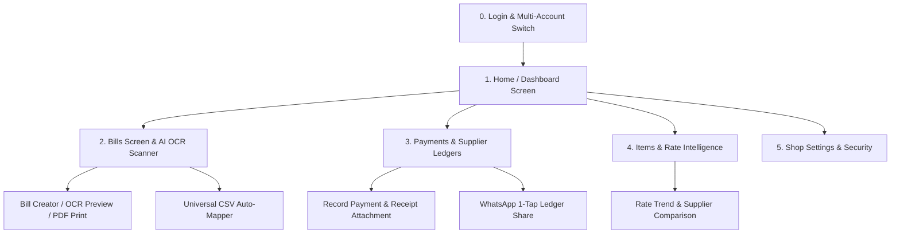

# Product Requirement Document (PRD)
## Dukan Bill Manager — Native Android App & Web SaaS Transformation

---

### 1. Executive Summary & Core Objective

**Dukan Bill Manager** is a high-performance business billing, Indian GST tracking, supplier ledger (Khata), rate intelligence, and automated AI invoice extraction application designed specifically for Indian retail shopkeepers, wholesale traders, distributors, and counter cashiers.

#### 1.1 Problem Statement
Small and medium retail business owners in India (kirana stores, electrical shops, hardware traders, garment retailers) deal with:
* **High-volume Physical GST Invoices:** Dozens of physical paper invoices arriving daily with diverse GST rates (0%, 5%, 12%, 18%, 28%).
* **Complex Ledger Reconciliations:** Tracking supplier outstandings, partial cash/UPI payments, and pending dues across multiple vendors (`Total Billed - Total Paid = Net Outstanding`).
* **Counter Price Volatility:** Inability to instantly verify historical purchase rates when a wholesale supplier quotes a new price at the counter (*"Pichli baar ye item kitne me aaya tha?"*).
* **Friction with Traditional Desktop ERPs:** Desktop software (e.g., Tally/Busy) requires dedicated desktop computers and trained accountants, whereas shopkeepers operate on 6-inch Android smartphones directly at the shop counter.

#### 1.2 Transformation Objective
Deliver a unified, offline-resilient, lightning-fast app experience across both **Native Android (Kotlin + Jetpack Compose + Room DB)** and **Web SaaS (Node.js Express + Vanilla JS Shell)** with:
1. **Camera AI OCR:** 1-tap live camera capture with Google Gemini Flash multi-key AI failover parsing invoices in < 3 seconds.
2. **Indian GST Calculation Engine:** Automatic State-of-Supply detection (Intra-state `CGST 50% + SGST 50%` vs Inter-state `IGST 100%`) with manual tax mode override.
3. **Live Supplier Khata & WhatsApp Reminders:** Automated net balance tracking with 1-tap `https://wa.me/` statement sharing.
4. **Item Rate Intelligence:** Instant lookup of historical purchase prices, supplier variations, and purchase dates.
5. **Universal Print & Thermal Export:** High-contrast Black & White layout optimized for 58mm/80mm Bluetooth thermal printers and A4 laser printers.
6. **Offline-First Sync:** Zero-latency local Room SQLite database with background synchronization to the Express server via WorkManager.

---

### 2. Target Audience & User Personas

| Persona | Role | Key Behaviors & Pain Points | Primary Mobile Needs |
| :--- | :--- | :--- | :--- |
| **Rajesh Bhai** (Kirana Shop Owner) | Main Owner / Operator | Manages shop counter, buys wholesale stock daily, receives paper bills on delivery. | Quick camera OCR scanning of paper bills, instant supplier outstanding summary, voice/quick search, 1-tap WhatsApp payment reminders. |
| **Vikas Sharma** (Wholesale Trader) | Multi-vendor Merchant | Deals with 50+ suppliers across states (Intra-state CGST+SGST vs Inter-state IGST). | GST auto-computation, Universal CSV/PDF invoice batch import, fast payment recording with UTR/cheque proof. |
| **Amit Verma** (Cashier / Store Staff) | Billing Operator | Enters items at counter, needs instant rate lookup to verify wholesale supplier quotes. | 1-tap item rate history ("Pichli baar kitne me aaya tha?"), low-bandwidth offline mode, zero-lag UI. |

---

### 3. Core Value Propositions & Business Goals

1. **Zero-Effort Bill Entry:** Google Gemini Flash AI OCR (`gemini-3.7-flash`, `gemini-3.6-flash`, `gemini-3.5-flash`, `gemini-3.5-flash-lite`, `gemini-flash-latest`) converts raw paper photos and PDF invoices into structured line items with multi-key failover.
2. **Crystal-Clear Supplier Ledgers:** Real-time net balance (`Total Billed - Total Paid = Net Balance`), overdue invoice tracking, and payment mode breakdowns.
3. **100% Tax Accuracy (Indian GST):** Automated State-of-Supply detection (Intra vs Inter-state), HSN tracking, split CGST/SGST/IGST math, and B&W high-contrast thermal/laser print formats.
4. **Item Rate Intelligence:** Instant lookup for any item to view historical purchase prices, supplier variations, and purchase dates.
5. **App-Grade Speed & Offline Resilience:** Instant touch response (<16ms 60fps), bottom navigation, swipe gestures, and optimistic UI updates backed by local Room DB / IndexedDB caching.

---

### 4. Comprehensive Feature Breakdown & Screen Specifications

#### 4.1 Authentication & Multi-Account Quick Switcher
* **Phone + Password Login:** 10-digit normalized Indian mobile numbers (`+91`) with secure JWT authentication stored in `EncryptedSharedPreferences` on Android and `httpOnly` cookies on Web.
* **Instant Multi-Account Switcher:** Switch between up to 6 shopkeeper profiles on a shared counter tablet/phone in 1 tap without credential re-entry.
* **Password Validation Checklist:** Strict 3-tier validation checklist:
  1. `6 to 32 characters long` (raised from 4 to reduce brute-force risk on shop-counter shared devices).
  2. `Passwords match`
  3. `No spaces allowed` (`np.length > 0 && !/\s/.test(np)`).

#### 4.2 Home Dashboard & Business Pulse
* **Quick Stats Strip:** Total Outstanding Due (₹), Total Invoices Count, Total Payments Made (₹), and Overdue Invoices Count.
* **Financial Trend Charts:** Pure Jetpack Compose Canvas / SVG interactive billing volume vs collection trends.
* **Recent Activity Feed:** Real-time stream of latest created bills, recorded payments, and critical overdue alerts.
* **Quick Action Floating Island (FAB):** 1-tap buttons for `Scan Bill (Camera)`, `Manual Bill`, `Record Payment`, `Check Rate`.

#### 4.3 Bills Management & Smart OCR Import
* **Bill List & Filter Bar:** Full-text instant search by Supplier name, Bill No, or line items. Status filter chips (`All`, `Unpaid`, `Partially Paid`, `Paid`, `Overdue`).
* **Mobile Card View:** Touch-optimized card list showing Supplier name, Bill No, Date, Status badge, and Grand Total with expandable item details.
* **Smart OCR Ingestion Pipeline:**
  * **Option A:** Live Camera capture via CameraX with live viewfinder and flash toggle.
  * **Option B:** File picker (Gallery image JPEG/PNG or digital PDF).
  * **Processing Engine:** Sends payload to `/api/ocr/extract` with multi-key failover pool (5 keys), 12s timeout sentinel, and model cascading (`gemini-3.7-flash` → `gemini-3.6-flash` → `gemini-3.5-flash` → `gemini-3.5-flash-lite` → `gemini-flash-latest`).
* **Universal CSV Importer:** Auto-maps arbitrary Indian GST invoice CSV column headers (e.g. `Party Name`, `Bill No`, `Item Description`, `HSN/SAC`, `Taxable Value`, `SGST/UTGST`) with memorized signatures.
* **Print & Export Engine:** High-contrast Black & White layout optimized for standard 80mm/58mm thermal receipt printers (Bluetooth ESC/POS) and A4 laser printers (`#000000` text, `#334155` borders).

#### 4.4 Supplier Ledgers & Payments
* **Supplier Ledger Summary:** List of all active suppliers sorted by highest outstanding dues.
* **Payment Entry Sheet:** Record payment with amount, payment mode (`Cash`, `UPI`, `Bank Transfer`, `Cheque`), reference UTR, and receipt photo attachment.
* **Account Reconciliation:** Visual balance breakdown: `Total Billed - Total Paid = Net Balance`.
* **1-Tap WhatsApp Sharing:** Generates clean, formatted ledger summaries with 1-tap `https://wa.me/` direct launch for payment follow-ups.
* **Payment History & Proof Viewer:** Modal/Sheet to view attached payment receipt images with pinch-to-zoom capabilities.

#### 4.5 Item Master & Rate Intelligence ("Pichli baar kitne me aaya tha?")
* **Item Catalog:** Alphabetical inventory list showing last purchase rate, HSN code, last supplier, and last purchase date.
* **Rate Lookup Intelligence:** Instant search for any item to view its supplier-wise price variation and historical rate movements to assist in bargaining at wholesale counters.

#### 4.6 Shop Profile, Settings & Notifications
* **Shop Identity Manager:** Shop name, GSTIN, Owner phone, Address, State, and Pincode configuration.
* **Notification Center:** Broadcast announcements and direct system alerts with individual item deletion (`✕`) and "Clear all" persistence.
* **Theme Customizer:** Modern Dark Mode, Light Mode, or System Auto-detect.

---

### 5. Non-Functional Requirements (NFR)

* **Performance:** First Contentful Paint (FCP) < 1.0s; Time to Interactive (TTI) < 1.8s on 4G mobile networks; 60 FPS Compose scrolling.
* **Security:** All endpoints protected with JWT cookie/Bearer authentication (15-minute access token + 7-day rotating refresh token), rate limiting on auth (10 req/5 min) and OCR (30 req/min), XSS input sanitization. Admin credentials use server-side `bcrypt` hashing with role-scoped JWT tokens.
* **Data Integrity:** Zero rounding errors in GST calculations using standard 2-decimal arithmetic; atomic file operations on backend JSON stores; Room SQLite ACID compliance.
* **Responsive Fluidity:** 100% responsive across viewports from 320px (compact smartphones) up to 2560px (4K monitors).
