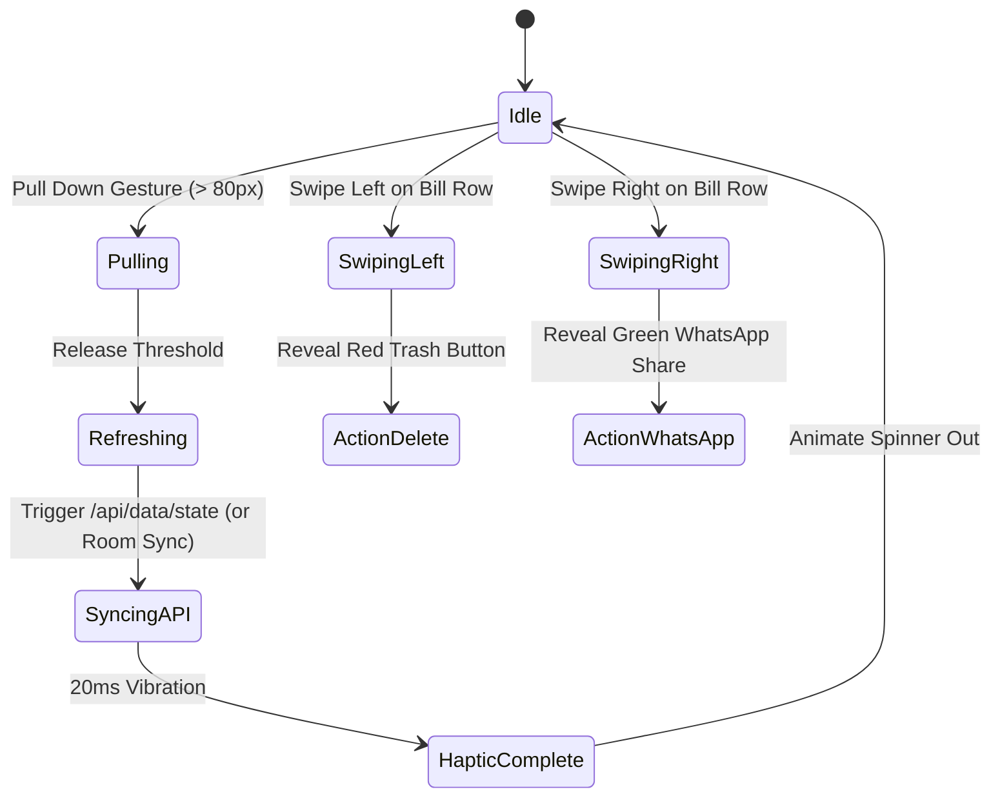

# UI/UX Specification & Design System
## Dukan Bill Manager — Native Android (Jetpack Compose) & Web SaaS Experience

---

### 1. Navigation Architecture & Layout System

The UI adapts intelligently based on the platform and screen form factor:
* **Mobile App & Viewports (< 768px):** Fixed Bottom Navigation Bar + Minimalist Top App Bar + Dynamic Bottom Sheets + Floating Action Buttons (FAB).
* **Desktop Web & Large Tablets (≥ 769px):** Collapsible Left Sidebar Rail (`72px` collapsed / `256px` hover-expanded) + Translucent Topbar + Centered Modal Dialogs.

```mermaid
graph TD
    subgraph Mobile UI Layout (< 768px / Android Native)
        TopBarMobile[Top App Bar: Brand Logo | Shop Name | Theme Toggle | Notifications | Profile]
        MainContentMobile[Scrollable LazyColumn: Touch Cards & Data-label Stacks]
        FAB[Floating Action Button: Quick Action Menu]
        BottomNav[Bottom Navigation Bar: Home | Bills | Add (+) | Payments | Lookup]
    end

    subgraph Desktop UI Layout (≥ 769px / Web SaaS)
        SidebarDesktop[Left Sidebar Rail: Brand | Navigation Tabs | Multi-Account Switcher | Settings]
        TopBarDesktop[Translucent Header: Shop Identity | Theme Toggle | Notifications | Profile]
        MainContentDesktop[Full Responsive Grid & Data Tables with Sticky Headers]
    end
```

#### 1.1 Mobile Bottom Navigation Bar Specification
| Tab Item | Icon (Material Symbols / Compose Vector) | Target Screen | Action / Route |
| :--- | :--- | :--- | :--- |
| **Home** | `Icons.Default.Dashboard` / `dashboard` | Dashboard Screen | `navigateTo(Screen.Dashboard)` |
| **Bills** | `Icons.Default.ReceiptLong` / `receipt_long` | Bills Master Screen | `navigateTo(Screen.Bills)` |
| **Quick Action (+)** | `Icons.Default.AddCircle` / `add_circle` (Primary Blue FAB) | Quick Action Bottom Sheet | Opens Sheet: Scan OCR / New Bill / Add Payment |
| **Payments** | `Icons.Default.Payments` / `payments` | Payments & Ledgers | `navigateTo(Screen.Payments)` |
| **Lookup** | `Icons.Default.SearchInsights` / `search_insights` | Rate Lookup & Items | `navigateTo(Screen.Lookup)` |

#### 1.2 Top App Bar (Header)
* **Left:** Brand avatar or Drawer hamburger icon.
* **Center / Inline:** Shop Name (e.g., *"Dukan Kirana"*) with tap-to-edit trigger.
* **Right:** 
  * Theme switch icon (`dark_mode` / `light_mode`).
  * Notification bell (`notifications`) with real-time numeric unread badge.
  * User profile avatar with initials (e.g., `RK`) & multi-account switch dropdown.

---

### 2. Mobile-First Interaction Patterns & Gestures



1. **Pull-to-Refresh:**
   * Elastic over-scroll at the top of lists.
   * Spinner rotates with haptic trigger upon crossing `80px` pull threshold.
2. **Swipe Actions (Table & Card Rows):**
   * **Swipe Left:** Reveals destructive action (Delete Bill / Payment) in danger red `#ef4444`.
   * **Swipe Right:** Reveals contextual shortcut (WhatsApp Share / Print Invoice) in emerald `#10b981`.
3. **App-Grade Bottom Sheets (Slide-up Modals):**
   * Replace desktop-centered modals on mobile viewports.
   * Include top grab handle (`width: 36px, height: 4px, border-radius: 2px`).
   * Support swipe-down gesture to dismiss or tap on blurred scrim (`backdrop-filter: blur(4px)`).
4. **Mobile Table Card Transformation (`data-label` Pattern):**
   * On mobile screens ($\le 768\text{px}$), wide multi-column tables transform into stacked touch cards with label on left and value on right.
5. **Haptic Touch Response:**
   * Soft vibration (`navigator.vibrate(15)` / Android `HapticFeedbackType`) on button taps, OCR success, and form submissions.

---

### 3. Design System & Style Tokens (Stitch SaaS Theme)

#### 3.1 Color Palette & Theme Tokens

```css
:root {
  /* Brand Accents */
  --primary: #1d4ed8;            /* Professional Royal Blue */
  --primary-hover: #1e40af;
  --primary-light: #eff6ff;
  --primary-container: #dbeafe;
  --on-primary: #ffffff;
  
  /* Neutral Surfaces (Light Mode) */
  --surface: #f8fafc;            /* Canvas background */
  --surface-container: #ffffff;  /* Card surface */
  --surface-container-high: #f1f5f9;
  --surface-container-low: #f8fafc;
  
  /* Outlines & Borders */
  --outline: #cbd5e1;
  --outline-variant: #dde2ec;    /* Hairline border */
  
  /* Typography Colors */
  --on-surface: #0f172a;         /* Primary text */
  --on-surface-variant: #64748b; /* Subtitles & secondary labels */
  --on-surface-muted: #94a3b8;   /* Hints & placeholders */
  
  /* Status Colors */
  --success: #10b981;
  --success-container: #d1fae5;
  --warning: #f59e0b;
  --warning-container: #fef3c7;
  --danger: #ef4444;
  --danger-container: #fee2e2;
}

[data-theme="dark"] {
  /* Brand Accents (Dark Mode) */
  --primary: #3b82f6;
  --primary-hover: #60a5fa;
  --primary-light: rgba(59, 130, 246, 0.15);
  --primary-container: rgba(59, 130, 246, 0.25);
  --on-primary: #ffffff;
  
  /* Neutral Surfaces (Deep Dark SaaS Palette) */
  --surface: #0f1117;            /* Deep charcoal canvas */
  --surface-container: #181b22;  /* High-contrast dark cards */
  --surface-container-high: #1f242d;
  --surface-container-low: #090a0d;
  
  /* Outlines & Borders */
  --outline: #2d333b;
  --outline-variant: #22272e;
  
  /* Typography Colors */
  --on-surface: #f8fafc;
  --on-surface-variant: #94a3b8;
  --on-surface-muted: #64748b;
}
```

#### 3.2 Android Jetpack Compose Theme Definition
```kotlin
val LightColorScheme = lightColorScheme(
    primary = Color(0xFF1D4ED8),
    onPrimary = Color.White,
    primaryContainer = Color(0xFFDBEAFE),
    surface = Color(0xFFF8FAFC),
    onSurface = Color(0xFF0F172A),
    outline = Color(0xFFCBD5E1),
    error = Color(0xFFEF4444)
)

val DarkColorScheme = darkColorScheme(
    primary = Color(0xFF3B82F6),
    onPrimary = Color.White,
    primaryContainer = Color(0x403B82F6),
    surface = Color(0xFF0F1117),
    surfaceVariant = Color(0xFF181B22),
    onSurface = Color(0xFFF8FAFC),
    outline = Color(0xFF2D333B),
    error = Color(0xFFEF4444)
)
```

#### 3.3 Typography System
| Category | Font Family | Weights | Usage |
| :--- | :--- | :--- | :--- |
| **Headline & Brand** | `'Hanken Grotesk', sans-serif` | 600, 700, 800 | Page titles, Modal headers, Brand text |
| **Body & UI** | `'Inter', sans-serif` | 400, 500, 600 | Body copy, Button text, Form inputs, Dropdowns |
| **Numbers & Finance** | `'JetBrains Mono', monospace` | 500, 600, 700 | Currency (₹), Invoices, Tax splits, Quantities |

#### 3.4 Strict Table Alignment Standards
* **Base Text Columns (Supplier, Bill No, Notes):** `text-align: left; padding: 16px;`
* **Status Badges & Dates:** `text-align: center;`
* **Financial Amounts (Taxable, GST, Total, Balance):** `text-align: right; font-family: 'JetBrains Mono';`
* **Action Buttons Column:** `text-align: center;`

---

### 4. Password Validation Checklist UI

Real-time dynamic checklist evaluated on user input:
1. `6 to 32 characters long` — Validated when length is between 6 and 32.
2. `Passwords match` — Validated when new password matches confirmation password.
3. `No spaces allowed` — Displayed at bottom, turns green only when input is non-empty and has zero whitespace (`np.length > 0 && !/\s/.test(np)`).

---

### 5. High-Contrast B&W Print & Thermal Receipt Layout

Print output must remain immune to theme overrides and adhere to strict physical printing constraints:
* **Backgrounds:** Pure `#ffffff` (transparent).
* **Text:** Solid `#000000` with zero grey fuzziness.
* **Borders:** `#334155` crisp 1px solid lines.
* **Thermal Paper Compatibility:** Auto-scales to 58mm and 80mm roll widths with condensed tabular line items.
