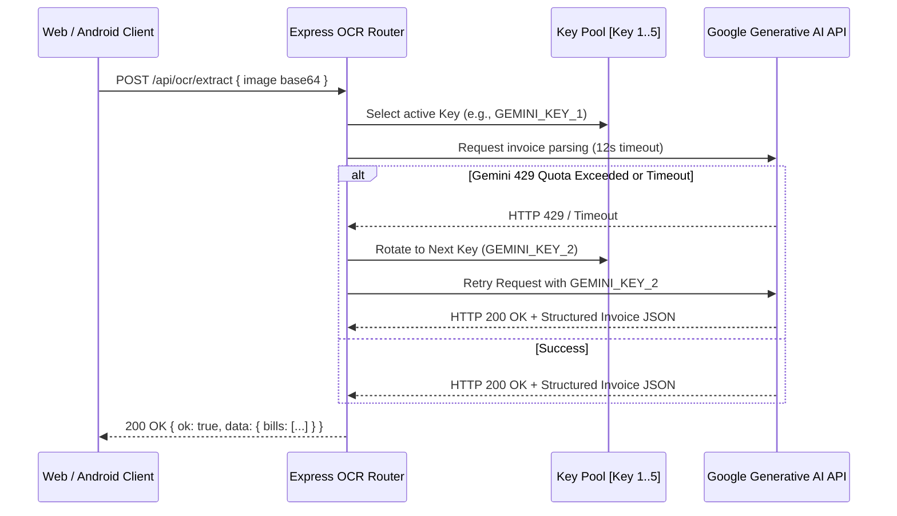
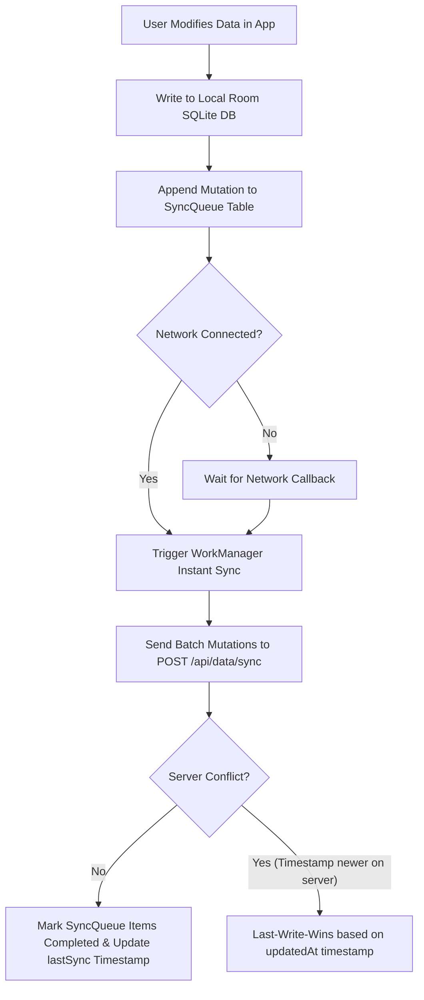

# System Architecture Document
## Dukan Bill Manager — Dual-Engine (Native Android + Web SaaS) Architecture

---

### 1. Architectural Overview & Design Principles

Dukan Bill Manager operates on a **Clean, Offline-Resilient, Event-Driven Architecture** designed to support both a full Native Android application and a lightweight, zero-build Web SaaS application.

```mermaid
graph TB
    subgraph Android Native Layer (Kotlin & Jetpack Compose)
        ComposeUI[Jetpack Compose UI & Material 3]
        VM[MainViewModel & StateFlow]
        UseCases[Domain Use Cases & Business Rules]
        RoomDB[(Room SQLite Local Database)]
        CameraEngine[CameraX & Image Capture]
        AndroidRetrofit[Retrofit & OkHttp Network Client]
        WorkManagerSync[WorkManager Background Sync Queue]
    end

    subgraph Web SaaS Layer (Vanilla JS & Express)
        WebUI[Pure Vanilla ES6+ SPA & Stitch Design CSS]
        StateStore[In-Memory Reactive State Container]
        WebCache[LocalStorage Snapshot Cache]
        WebSync[api-sync.js Synchronizer]
    end

    subgraph Backend API Services (Node.js & Express)
        Router[API Gateway & Route Handlers]
        RateLimiter[Rate Limiters & Auth Guards]
        OCRProxy[Gemini AI Multi-Key Failover Engine]
        JSONStore[Atomic JSON Persistence (.tmp rename)]
        ReceiptStorage[Uploads Receipt Media Store]
    end

    subgraph External Cloud Services
        GeminiPool[Google Gemini AI Models Pool - 5 Keys]
    end

    ComposeUI <--> VM
    VM <--> UseCases
    UseCases <--> RoomDB
    UseCases <--> AndroidRetrofit
    WorkManagerSync <--> RoomDB
    WorkManagerSync <--> AndroidRetrofit
    CameraEngine --> VM

    WebUI <--> StateStore
    StateStore <--> WebCache
    StateStore <--> WebSync
    
    WebSync <--> Router
    AndroidRetrofit <--> Router
    Router --> RateLimiter
    RateLimiter --> OCRProxy
    RateLimiter --> JSONStore
    RateLimiter --> ReceiptStorage
    OCRProxy <--> GeminiPool
```

---

### 2. Dual Platform Comparison & Implementation Matrix

| Metric / Layer | Web SaaS Version (`web-project/update app`) | Native Android Version (`app/`) |
| :--- | :--- | :--- |
| **Language & UI** | Pure Vanilla JS (ES6+), CSS3 Variables, SVG charts | Kotlin 2.0+, Jetpack Compose, Material 3, Canvas Charts |
| **Architecture** | Modular Functional Modules + State Store | Clean Architecture (UI -> ViewModel -> UseCase -> Repository -> DAO/API) |
| **State Management** | Global `window.State` object + Event callbacks | `ViewModel`, `StateFlow`, `SharedFlow`, Kotlin Coroutines |
| **Persistence** | Multi-tenant JSON files (`data/users/<userId>.json`) + `localStorage` | Android Room SQLite DB (`BillEntity`, `SupplierEntity`, `PaymentEntity`, `ItemEntity`, `SyncQueueEntity`) |
| **Camera & OCR** | HTML5 Camera Capture + Base64 Fetch to `/api/ocr/extract` | CameraX Preview + Retrofit to Gemini Proxy / ML Kit |
| **Offline Sync** | In-browser online/offline event + `api-sync.js` | Android `WorkManager` background recurring worker with exponential backoff |
| **Build System** | Zero-build footprint (Instant edit & run via `start-server.bat`) | Gradle KTS (`build.gradle.kts`), ProGuard, Android SDK 35 |

---

### 3. Multi-Key Gemini AI OCR Failover Engine (`api/routes/ocr.js`)

To guarantee 99.9% uptime during busy shop hours:
1. **API Key Pool:** Maintains an array of 5 Gemini API keys configured in pool (`GEMINI_KEY_1` … `GEMINI_KEY_5` or comma-separated `GEMINI_API_KEYS` in environment variables).
2. **Model Cascading:** Cycles through `gemini-3.7-flash` → `gemini-3.6-flash` → `gemini-3.5-flash` → `gemini-3.5-flash-lite` → `gemini-flash-latest` on model errors.
3. **Timeout Sentinel:** Strict 12-second abort timeout per request to prevent client hangs.
4. **Quota Rotation:** Immediately jumps to the next API key in the pool if HTTP `429 (Too Many Requests)` or `403 (Quota Exceeded)` is received.



---

### 4. Offline Synchronization & Conflict Resolution Protocol



1. **Optimistic UI:** Android app commits edits immediately to local Room DB and reflects them on UI (<16ms).
2. **Sync Queue:** Mutations (`CREATE_BILL`, `UPDATE_BILL`, `DELETE_BILL`, `RECORD_PAYMENT`, `UPDATE_SUPPLIER`) are saved as pending records in `sync_queue` table.
3. **WorkManager:** Background worker executes when network constraint (`NetworkType.CONNECTED`) is met.
4. **Conflict Policy:** Field-level merging with "Last Write Wins" (LWW) based on ISO-8601 UTC millisecond timestamps.

---

### 5. Atomic File Persistence Guarantee (Backend)

To prevent database corruption during power loss or system crashes on the counter machine:
* All disk writes are saved to a temporary file (`<filename>.tmp`).
* The system then executes an atomic rename (`fs.renameSync`) to replace the target `<userId>.json`.

---

### 6. Authentication Token Lifecycle & Admin Security

* **Access Token:** Short-lived JWT (15 minutes) stored in `httpOnly`, `SameSite=Lax` cookie (`dukan_token`) for Web; stored as Bearer token in Android `EncryptedSharedPreferences`.
* **Refresh Token:** 7-day rotating refresh token, single-use (rotated on every refresh; reuse triggers immediate family session revocation).
* **Admin Authentication:** Admin routes require role-scoped admin JWT issued at `/api/auth/admin/login` using `bcrypt` hash verification. All admin actions are audit-logged in `api/data/admin-audit.log`.

---

### 7. Terminal QR Code Startup System (`api/print-qr.js`)

When `start-server.bat` is executed:
1. The script inspects all active network interfaces to find local IPv4 addresses (e.g. `192.168.1.15:3000`).
2. Generates ANSI block scannable QR codes directly in the Windows command terminal.
3. Allows the shopkeeper to scan the QR code using their Android smartphone camera to pair instantly on the local WiFi network.
