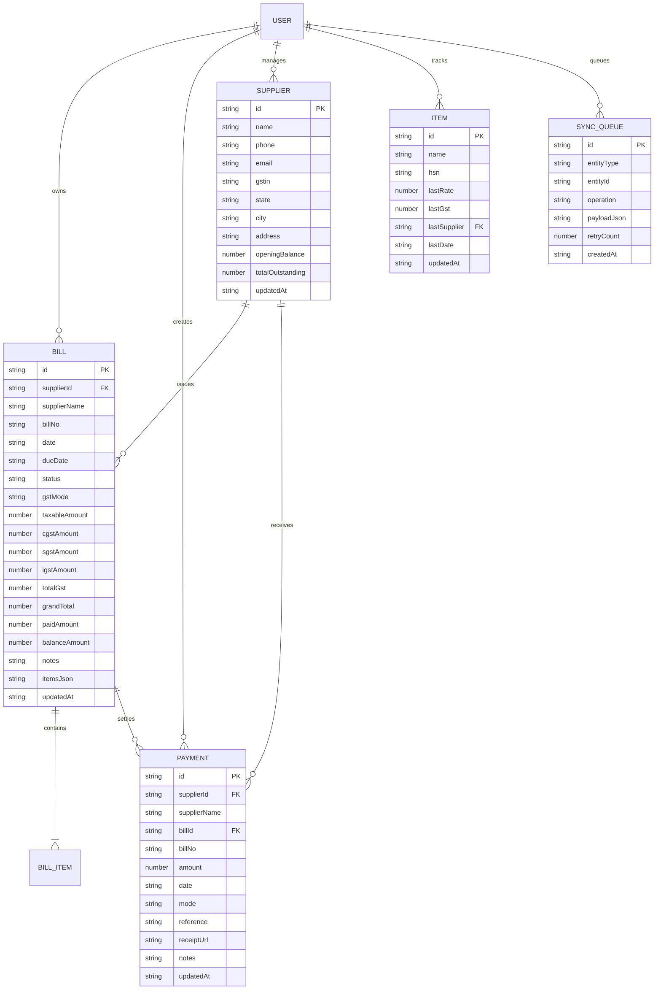

# Database Schema & Data Models Specification
## Dukan Bill Manager — Room SQLite Database & Server JSON Schemas

---

### 1. Storage Architecture Overview

The system supports two unified data representations:
1. **Android Room SQLite Database:** Type-safe, indexed local tables (`bills`, `suppliers`, `payments`, `items`, `sync_queue`).
2. **Server Multi-Tenant JSON Model:** Isolated per-user state file (`api/data/users/<userId>.json`).



---

### 2. Android Room Database Implementation (`com.dukan.app.data.local`)

#### 2.1 Database Definition
```kotlin
@Database(
    entities = [
        BillEntity::class,
        SupplierEntity::class,
        PaymentEntity::class,
        ItemEntity::class,
        SyncQueueEntity::class
    ],
    version = 1,
    exportSchema = true
)
@TypeConverters(AppTypeConverters::class)
abstract class DukanDatabase : RoomDatabase() {
    abstract fun billDao(): BillDao
    abstract fun supplierDao(): SupplierDao
    abstract fun paymentDao(): PaymentDao
    abstract fun itemDao(): ItemDao
    abstract fun syncQueueDao(): SyncQueueDao
}
```

#### 2.2 Room Entities

##### `BillEntity`
```kotlin
@Entity(
    tableName = "bills",
    indices = [
        Index(value = ["billNo"]),
        Index(value = ["supplierName"]),
        Index(value = ["date"]),
        Index(value = ["status"])
    ]
)
data class BillEntity(
    @PrimaryKey val id: String,
    val supplierId: String,
    val supplierName: String,
    val billNo: String,
    val date: String,             // ISO-8601 YYYY-MM-DD
    val dueDate: String,
    val status: BillStatus,       // UNPAID, PARTIAL, PAID, OVERDUE
    val gstMode: GstMode,         // CGST_SGST, IGST, NONE
    val itemsJson: String,        // Serialized List<BillItem> JSON
    val taxableAmount: Double,
    val cgstAmount: Double,
    val sgstAmount: Double,
    val igstAmount: Double,
    val totalGst: Double,
    val grandTotal: Double,
    val paidAmount: Double,
    val balanceAmount: Double,
    val notes: String = "",
    val updatedAt: Long = System.currentTimeMillis()
)
```

##### `SupplierEntity`
```kotlin
@Entity(
    tableName = "suppliers",
    indices = [
        Index(value = ["name"]),
        Index(value = ["phone"])
    ]
)
data class SupplierEntity(
    @PrimaryKey val id: String,
    val name: String,
    val phone: String = "",
    val email: String = "",
    val gstin: String = "",
    val state: String = "",
    val city: String = "",
    val address: String = "",
    val openingBalance: Double = 0.0,
    val totalOutstanding: Double = 0.0,
    val updatedAt: Long = System.currentTimeMillis()
)
```

##### `PaymentEntity`
```kotlin
@Entity(
    tableName = "payments",
    indices = [
        Index(value = ["supplierId"]),
        Index(value = ["billId"]),
        Index(value = ["date"])
    ]
)
data class PaymentEntity(
    @PrimaryKey val id: String,
    val supplierId: String,
    val supplierName: String,
    val billId: String? = null,
    val billNo: String? = null,
    val amount: Double,
    val date: String,
    val mode: PaymentMode,        // CASH, UPI, BANK_TRANSFER, CHEQUE
    val reference: String = "",
    val receiptUrl: String? = null,
    val notes: String = "",
    val updatedAt: Long = System.currentTimeMillis()
)
```

##### `ItemEntity`
```kotlin
@Entity(
    tableName = "items",
    indices = [Index(value = ["name"], unique = true)]
)
data class ItemEntity(
    @PrimaryKey val id: String,
    val name: String,
    val hsn: String = "",
    val lastRate: Double,
    val lastGst: Double = 0.0,
    val lastSupplier: String = "",
    val lastDate: String = "",
    val updatedAt: Long = System.currentTimeMillis()
)
```

##### `SyncQueueEntity`
```kotlin
@Entity(tableName = "sync_queue")
data class SyncQueueEntity(
    @PrimaryKey val id: String,
    val entityType: String,       // "BILL", "SUPPLIER", "PAYMENT", "ITEM"
    val entityId: String,
    val operation: String,        // "CREATE", "UPDATE", "DELETE"
    val payloadJson: String,
    val retryCount: Int = 0,
    val createdAt: Long = System.currentTimeMillis()
)
```

---

### 3. Data Access Objects (DAOs)

#### 3.1 `BillDao`
```kotlin
@Dao
interface BillDao {
    @Query("SELECT * FROM bills ORDER BY date DESC")
    fun getAllBills(): Flow<List<BillEntity>>

    @Query("SELECT * FROM bills WHERE id = :id LIMIT 1")
    suspend fun getBillById(id: String): BillEntity?

    @Query("SELECT * FROM bills WHERE supplierName LIKE '%' || :query || '%' OR billNo LIKE '%' || :query || '%'")
    fun searchBills(query: String): Flow<List<BillEntity>>

    @Query("SELECT * FROM bills WHERE status = :status ORDER BY date DESC")
    fun getBillsByStatus(status: BillStatus): Flow<List<BillEntity>>

    @Insert(onConflict = OnConflictStrategy.REPLACE)
    suspend fun upsertBill(bill: BillEntity)

    @Delete
    suspend fun deleteBill(bill: BillEntity)
}
```

#### 3.2 `SupplierDao`
```kotlin
@Dao
interface SupplierDao {
    @Query("SELECT * FROM suppliers ORDER BY totalOutstanding DESC, name ASC")
    fun getAllSuppliers(): Flow<List<SupplierEntity>>

    @Query("SELECT * FROM suppliers WHERE id = :id LIMIT 1")
    suspend fun getSupplierById(id: String): SupplierEntity?

    @Insert(onConflict = OnConflictStrategy.REPLACE)
    suspend fun upsertSupplier(supplier: SupplierEntity)

    @Query("UPDATE suppliers SET totalOutstanding = :outstanding WHERE id = :id")
    suspend fun updateOutstanding(id: String, outstanding: Double)
}
```

---

### 4. Server JSON State Schema (`api/data/users/<userId>.json`)

```json
{
  "bills": [
    {
      "id": "bill-1723456789000",
      "supplierId": "sup-1723456789000",
      "supplier": "Radha Krishna Wholesalers",
      "billNo": "INV-2026-8941",
      "date": "2026-08-22",
      "dueDate": "2026-09-05",
      "status": "Unpaid",
      "gstMode": "CGST_SGST",
      "items": [
        {
          "name": "Fortune Sunlite Sunflower Oil 1L",
          "hsn": "1512",
          "qty": 40,
          "unit": "Pouch",
          "rate": 115.00,
          "discount": 0.00,
          "gstPercent": 5,
          "cgstAmount": 115.00,
          "sgstAmount": 115.00,
          "igstAmount": 0.00,
          "taxableAmount": 4600.00,
          "total": 4830.00
        }
      ],
      "taxableAmount": 4600.00,
      "cgstAmount": 115.00,
      "sgstAmount": 115.00,
      "igstAmount": 0.00,
      "totalGst": 230.00,
      "grandTotal": 4830.00,
      "paidAmount": 0.00,
      "balanceAmount": 4830.00,
      "notes": "Delivered at morning shift",
      "updatedAt": 1723456789000
    }
  ],
  "suppliers": [
    {
      "id": "sup-1723456789000",
      "name": "Radha Krishna Wholesalers",
      "phone": "9876543210",
      "email": "sales@radhakrishna.com",
      "gstin": "23AAAAA0000A1Z5",
      "state": "Madhya Pradesh",
      "city": "Indore",
      "address": "12 Siyaganj Wholesale Market",
      "openingBalance": 0.00,
      "totalOutstanding": 4830.00,
      "updatedAt": 1723456789000
    }
  ],
  "payments": [
    {
      "id": "pay-1723456789000",
      "supplierId": "sup-1723456789000",
      "billId": "bill-1723456789000",
      "amount": 2000.00,
      "date": "2026-08-22",
      "mode": "UPI",
      "reference": "UPI/423589012345",
      "receiptUrl": "/uploads/receipts/pay-1723456789000.jpg",
      "receiptName": "upi_screenshot.jpg",
      "notes": "Advance payment via PhonePe",
      "updatedAt": 1723456789000
    }
  ],
  "items": [
    {
      "id": "itm-fortune-sunlite-1l",
      "name": "Fortune Sunlite Sunflower Oil 1L",
      "hsn": "1512",
      "lastRate": 115.00,
      "lastGst": 5,
      "lastSupplier": "sup-1723456789000",
      "lastDate": "2026-08-22",
      "updatedAt": 1723456789000
    }
  ],
  "shopName": "Dukan Kirana & Provision Store",
  "shopAddress": "Shop No. 4, Main Road, Bhopal",
  "shopPhone": "9812345678",
  "shopPincode": "462001",
  "companyState": "Madhya Pradesh",
  "theme": "light",
  "readNotificationIds": ["notif-101"],
  "deletedNotificationIds": ["notif-100"],
  "lastSync": "2026-08-22T14:30:00.000Z"
}
```
