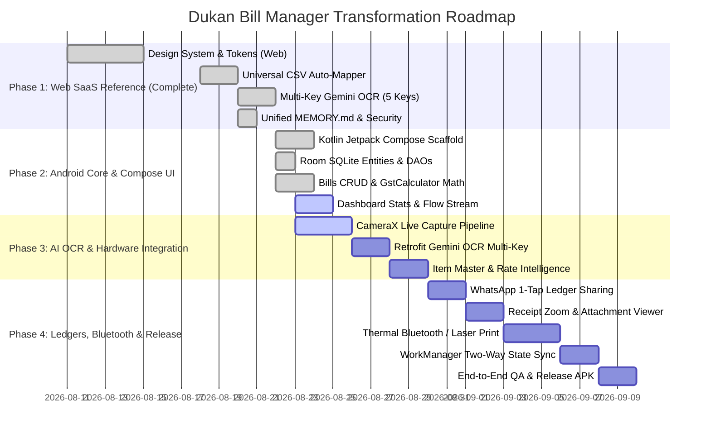

# Implementation Roadmap & Execution Strategy
## Dukan Bill Manager — Native Android App & Cloud Sync Roadmap

---

### 1. Roadmap Overview & Timeline

---

### 2. Sprint-by-Sprint Development Breakdown

#### Sprint 1: Project Scaffolding & Stitch Design System
* Setup Kotlin 2.0+, Gradle KTS, Jetpack Compose, Material 3.
* Configure theme colors (`LightColorScheme`, `DarkColorScheme`), Stitch typography (`Hanken Grotesk`, `Inter`, `JetBrains Mono`).
* Implement Bottom Navigation Scaffold (`Home`, `Bills`, `+ Action`, `Payments`, `Lookup`).

#### Sprint 2: Room SQLite Database & Offline Repositories
* Create Room Database with `BillEntity`, `SupplierEntity`, `PaymentEntity`, `ItemEntity`, `SyncQueueEntity`.
* Write DAOs with reactive Kotlin Coroutine `Flow` streams.
* Implement repository pattern with optimistic local caching.

#### Sprint 3: Indian GST Calculation Engine & Billing UI
* Port 100% accurate GST math to `GstCalculator.kt`:
  * Intra-state: `CGST = 50%`, `SGST = 50%`.
  * Inter-state: `IGST = 100%`.
* Build `BillListScreen` with status chips and `AddEditBillScreen` with dynamic line items table.

#### Sprint 4: CameraX Live Scanner & Gemini Multi-Key OCR
* Integrate CameraX with custom viewfinder overlay and flash control.
* Base64 image compression & Retrofit API call to `/api/ocr/extract`.
* Auto-populate bill fields from structured AI response.

#### Sprint 5: Supplier Ledgers (Khata) & 1-Tap WhatsApp Reminders
* Build `SupplierLedgerScreen` with calculated `totalOutstanding`.
* Implement `PaymentEntryBottomSheet` with mode selection (`Cash`, `UPI`, `Bank Transfer`, `Cheque`) and receipt camera attachment.
* Generate pre-formatted Hindi/English payment reminder texts with direct `https://wa.me/` launching.

#### Sprint 6: Item Master & Rate Intelligence
* Implement `ItemsLookupScreen` with search bar and autocomplete.
* Display historical purchase rates, supplier variations, and price movement charts (*"Pichli baar kitne me aaya tha?"*).

#### Sprint 7: ESC/POS Bluetooth Thermal Printing & PDF Export
* Implement ESC/POS byte generator for 58mm and 80mm roll printers.
* Android PrintManager integration for crisp A4 Black & White invoice printing.

#### Sprint 8: WorkManager Background Two-Way Sync
* Implement `SyncWorker` triggered by network connectivity and periodic interval (15 mins).
* Sync local `SyncQueueEntity` mutations to `POST /api/data/sync`.
* Pull remote state updates with timestamp conflict resolution.

#### Sprint 9: Testing, ProGuard & Production Release
* Unit tests for `GstCalculator`, `BillDao`, `SyncRepository`.
* Configure ProGuard / R8 rules for Room, Retrofit, and Kotlinx Serialization.
* Generate signed Release APK / AAB bundle.

---

### 3. Verification & Quality Assurance Checklist

| Checkpoint | Target Standard | Verification Method |
| :--- | :--- | :--- |
| **GST Tax Precision** | Split CGST (50%) + SGST (50%) for Intra-state; IGST (100%) for Inter-state | Unit test suite with 50+ mixed GST slab fixtures. |
| **OCR Scan Latency** | Full line-item extraction in < 3.5s | Benchmark on 10MP camera invoice photos with 10+ items. |
| **Touch Latency** | 60 FPS scrolling, < 16ms button response | Android Profiler & GPU Rendering inspection. |
| **Offline Resilience** | Zero data loss on abrupt network disconnection | Room DB transactions & SQLite ACID integrity tests. |
| **Print Output** | High-contrast `#000000` text, `#334155` borders | Physical thermal roll & laser printer test prints. |
| **Auth & Security** | JWT tokens refreshed seamlessly; admin endpoints protected | Automated API regression test suite. |
