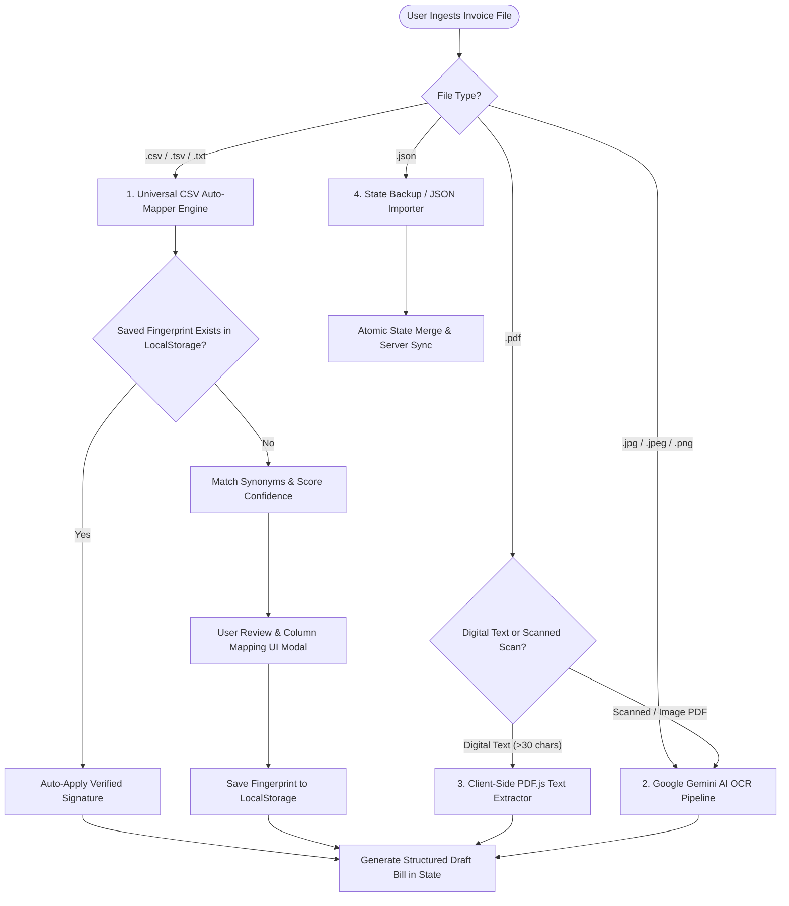

# Invoice & Bill Import Specification Document
## Dukan Bill Manager — Universal CSV Auto-Mapper, AI OCR & Digital PDF Ingestion

---

### 1. Ingestion Engine Architecture Overview

**Dukan Bill Manager** provides a multi-modal invoice import engine designed to handle real-world Indian retail invoices across four distinct ingestion pathways:



---

### 2. Universal CSV Auto-Mapper Engine

The CSV Ingestion engine does not rely on hardcoded supplier layouts. Instead, it uses a **dynamic synonym dictionary**, **header normalization**, **confidence scoring**, and **fingerprint caching**.

#### 2.1 Complete Header Synonym Dictionary

When parsing CSV columns, headers are stripped of punctuation, parentheticals, and normalized to lowercase before matching against this comprehensive dictionary:

| Target Field | Data Type | Recognized Header Synonyms | Description & Notes |
| :--- | :--- | :--- | :--- |
| **`item_name`** *(Required)* | String | `item`, `item name`, `item description`, `description of goods`, `description`, `particulars`, `product name`, `product`, `goods`, `material`, `material description`, `item particulars`, `goods description` | Product title or item description |
| **`qty`** *(Required)* | Numeric | `qty`, `quantity`, `qnty`, `pcs`, `units`, `no of pieces`, `no. of pieces`, `count`, `total qty`, `boxes`, `qty.`, `qty pcs`, `qty (pcs)`, `quantity pcs`, `qty in pcs` | Billed item quantity |
| **`rate`** *(Required)* | Numeric | `rate`, `price`, `price/pc`, `unit price`, `unit price excl gst`, `base rate`, `basic rate`, `net rate`, `purchase rate`, `purchase price`, `sale rate`, `sales rate`, `gross rate`, `basic price`, `cost`, `price pc` | Base unit price (excluding GST) |
| **`rate_incl_tax`** | Numeric | `rate incl of tax`, `rate (incl. of tax)`, `rate incl tax`, `price incl tax`, `rate inclusive`, `mrp incl tax`, `price (incl. tax)` | Unit rate including GST (auto-converts to base rate) |
| **`gst_percent`** | Numeric | `gst %`, `gst%`, `gst rate`, `gst rate %`, `tax %`, `tax rate`, `total gst %`, `gst pct`, `gst percent`, `tax pct`, `tax percent` | Combined GST tax slab percentage (e.g., `5`, `12`, `18`, `28`) |
| **`cgst_percent`** | Numeric | `cgst %`, `cgst%`, `cgst rate`, `central tax rate`, `cgst rate (in %)` | Central GST percentage (typically 50% of total GST) |
| **`cgst_amount`** | Numeric | `cgst amount`, `cgst amt`, `cgst`, `central tax`, `central tax amount`, `cgst rs`, `cgst val` | Central GST amount in INR |
| **`sgst_percent`** | Numeric | `sgst %`, `sgst%`, `sgst rate`, `state tax rate`, `sgst rate (in %)` | State GST percentage (typically 50% of total GST) |
| **`sgst_amount`** | Numeric | `sgst amount`, `sgst amt`, `sgst`, `state tax`, `state tax amount`, `sgst rs`, `sgst val` | State GST amount in INR |
| **`igst_percent`** | Numeric | `igst %`, `igst%`, `igst rate`, `integrated tax rate`, `igst rate (in %)` | Integrated GST percentage (for Inter-state transactions) |
| **`igst_amount`** | Numeric | `igst amount`, `igst amt`, `igst`, `integrated tax`, `integrated tax amount`, `igst rs` | Integrated GST amount in INR |
| **`hsn`** | String | `hsn`, `hsn/sac`, `hsn sac`, `hsn_sac`, `sac`, `hsn code`, `sac code`, `harmonized system` | 4, 6, or 8-digit Indian HSN/SAC code |
| **`discount_pct`** | Numeric | `disc %`, `disc%`, `disc. %`, `discount %`, `discount%`, `disc pct`, `discount pct`, `scheme(%)`, `scheme %`, `less %`, `discount percent` | Percentage line discount |
| **`discount_amt`** | Numeric | `disc amount`, `discount amount`, `discount amt`, `disc amt`, `less amount`, `less amt`, `disc rs`, `discount rs`, `disc val` | Total discount amount in INR for the row |
| **`free_qty`** | Numeric | `free`, `free qty`, `free quantity`, `scheme qty`, `bonus qty`, `bonus`, `free pcs`, `offer qty` | Bonus / promotional quantity |
| **`mrp`** | Numeric | `mrp`, `mrp marginal`, `mrp/marginal`, `mrp per`, `mrp/pc`, `printed price`, `list price`, `maximum retail price` | Maximum Retail Price printed on packaging |
| **`unit`** | String | `unit`, `uom`, `per`, `measure`, `pack`, `packing`, `measuring unit` | Unit of measure (`Pcs`, `Kg`, `Bag`, `Box`, `Pouch`, `Ltr`) |
| **`taxable_amount`** | Numeric | `taxable`, `taxable amount`, `taxable amt`, `net amount`, `base amount`, `assessable value`, `taxable value` | Assessable value before tax: `(Qty × Rate) - Discount` |
| **`amount`** | Numeric | `amount`, `line amount`, `line total`, `line total incl gst`, `total`, `total amount`, `row total`, `gross amount`, `grand total` | Line total amount including taxes |
| **`invoice_no`** | String | `invoice no`, `invoice no.`, `invoice number`, `invoice #`, `bill no`, `bill no.`, `bill number`, `ref no`, `inv no` | Bill / Invoice unique identifier |
| **`invoice_date`** | Date | `invoice date`, `bill date`, `date`, `transaction date`, `doc date`, `entry date` | Invoice issue date |
| **`seller_name`** | String | `seller`, `seller name`, `supplier`, `supplier name`, `vendor`, `vendor name`, `party`, `party name`, `sold by`, `billed by` | Supplier / Vendor entity name |
| **`seller_gstin`** | String | `seller gstin`, `gstin`, `gstin/uin`, `tax id`, `seller gst`, `gstin no` | 15-character alphanumeric GSTIN of seller |
| **`seller_phone`** | String | `seller phone`, `phone`, `contact`, `mobile`, `contact no`, `phone no` | Supplier phone / mobile number |
| **`seller_address`** | String | `seller address`, `address`, `addr`, `full address`, `street`, `seller addr` | Supplier physical address |
| **`seller_city`** | String | `seller city`, `city`, `town` | Supplier city / market center |
| **`seller_state`** | String | `seller state`, `state`, `state name` | Supplier state (used for GST Intra vs Inter-state math) |
| **`seller_pincode`** | String | `seller pincode`, `pincode`, `pin`, `zip code`, `pin code` | 6-digit postal code |

---

### 3. Standard CSV Templates & Formats

#### 3.1 Template A: Simple Retailer / Kirana CSV (Minimalist)
Ideal for small shopkeepers entering basic inventory stock:

```csv
Item Name,Qty,Rate,GST %,Unit
Fortune Sunlite Sunflower Oil 1L,40,115.00,5,Pouch
Tata Salt 1kg,50,24.00,5,Packet
Aashirvaad Shudh Chakki Atta 10kg,15,380.00,0,Bag
Maggi 2-Minute Noodles 70g,96,12.50,12,Packet
Surf Excel Quick Wash 1kg,24,140.00,18,Packet
```

#### 3.2 Template B: Full Indian GST Multi-Tax Invoice CSV (Comprehensive)
Ideal for wholesale distributors with complete GST breakdown:

```csv
Invoice No,Invoice Date,Supplier Name,GSTIN,Item Description,HSN,Qty,Unit,Rate,Discount %,GST %,Total Amount
INV-2026-8941,2026-08-29,Radha Krishna Wholesalers,23AAAAA0000A1Z5,Fortune Sunlite Oil 1L,1512,40,Pouch,115.00,0,5,4830.00
INV-2026-8941,2026-08-29,Radha Krishna Wholesalers,23AAAAA0000A1Z5,Basmati Rice Special 25kg,1006,10,Bag,1850.00,2,5,19036.50
INV-2026-8941,2026-08-29,Radha Krishna Wholesalers,23AAAAA0000A1Z5,Tata Tea Gold 500g,0902,30,Packet,260.00,0,5,8190.00
```

#### 3.3 Template C: Tally / Busy Export Format (Separate CGST & SGST Amounts)
Compatible with standard exports from Tally ERP, Busy Accounting, and Marg:

```csv
Vch No,Date,Party Name,Particulars,HSN/SAC,Quantity,Rate,Taxable Value,CGST Amount,SGST Amount,Gross Total
TLY-0492,29-08-2026,Shree Ganesh Agency,Dettol Antiseptic 500ml,3004,20,160.00,3200.00,288.00,288.00,3776.00
TLY-0492,29-08-2026,Shree Ganesh Agency,Colgate MaxFresh 150g,3306,48,92.00,4416.00,397.44,397.44,5210.88
```

---

### 4. Data Parsing & Sanitization Rules

#### 4.1 Date Format Parser
The parser handles standard Indian and international date formats automatically:
* `DD/MM/YYYY` (e.g. `29/08/2026`)
* `DD-MM-YYYY` (e.g. `29-08-2026`)
* `YYYY-MM-DD` (e.g. `2026-08-29` — ISO standard)
* `MM/DD/YYYY` (e.g. `08/29/2026`)
* `DD.MM.YYYY` (e.g. `29.08.2026`)
* Auto-normalizes all output dates to `YYYY-MM-DD`.

#### 4.2 Numeric & Currency Sanitizer
* Strips currency symbols (`₹`, `Rs`, `INR`, `$`).
* Normalizes Indian comma notation (e.g. `1,25,000.50` -> `125000.50`).
* Trims trailing percentage symbols (e.g. `18%` -> `18.0`).
* Replaces invalid / blank numeric strings with `0.0`.

#### 4.3 GST Tax Auto-Split Logic
* If `cgst_amount` and `sgst_amount` are provided: system marks GST mode as `CGST_SGST`.
* If `igst_amount` is provided: system marks GST mode as `IGST`.
* If only `gst_percent` is provided:
  * Compares `seller_state` with `shop_state` (Settings).
  * If identical: splits into `CGST (50%) + SGST (50%)`.
  * If different: assigns `IGST (100%)`.

---

### 5. Google Gemini AI OCR Ingestion Engine

When a paper bill photo or scanned PDF is uploaded:
* **Supported MIME Types:** `image/jpeg`, `image/png`, `application/pdf`
* **File Limit:** Up to 5MB.
* **Endpoint:** `POST /api/ocr/extract`

#### 5.1 Multi-Key Failover & Cascading Model Sequence
The server rotates through a pool of 5 API keys and cascades models in this order:
1. `gemini-3.7-flash` (Primary)
2. `gemini-3.6-flash`
3. `gemini-3.5-flash`
4. `gemini-3.5-flash-lite`
5. `gemini-flash-latest`

#### 5.2 Structured Output Schema Returned by OCR
```json
{
  "ok": true,
  "data": {
    "bills": [
      {
        "invoice_no": "INV-2026-042",
        "date": "2026-08-29",
        "seller_name": "Radha Krishna Wholesalers",
        "seller_phone": "9876543210",
        "seller_gstin": "23AAAAA0000A1Z5",
        "seller_state": "Madhya Pradesh",
        "seller_city": "Indore",
        "seller_address": "12 Siyaganj Wholesale Market",
        "items": [
          {
            "name": "Fortune Sunlite Sunflower Oil 1L",
            "hsn": "1512",
            "qty": 40,
            "unit": "Pouch",
            "rate": 115.00,
            "discount": 0.0,
            "gst_percent": 5.0,
            "cgst_amount": 115.00,
            "sgst_amount": 115.00,
            "igst_amount": 0.0,
            "taxable_amount": 4600.00,
            "amount": 4830.00
          }
        ]
      }
    ]
  }
}
```

---

### 6. Client-Side Digital PDF Text Extraction (`pdf.js`)

For digital computerized PDF invoices (e.g., invoices downloaded from wholesale portals):
1. **Detection:** Checks if the first page contains more than 30 selectable text characters (`combinedText.length > 30`).
2. **Y-Coordinate Grouping:** Groups text spans by their vertical `Y` coordinate to reconstruct line items.
3. **Tabular Text to Rows:** Converts structured line columns into tabular rows and passes them into the CSV Auto-Mapper engine.
4. **Fallback:** If character count $\le 30$ (indicating a scanned flat image inside a PDF), the file is automatically redirected to the Gemini AI OCR pipeline.

---

### 7. Troubleshooting & Common Ingestion Errors

| Error Symptom | Cause | Solution |
| :--- | :--- | :--- |
| **"No Item Name or Quantity found"** | Column headers are missing or unreadable. | Open Mapping Modal and manually link the item name and qty columns. |
| **GST doubled or incorrect** | CSV contains both `gst_percent` and explicit `cgst_amount` columns. | In Mapping Modal, map either the tax percentages OR the tax amounts, not both. |
| **Date displayed as 1970-01-01** | Non-standard date format (e.g. `29 Aug 2026`). | Use standard numerical date formats (`29/08/2026` or `2026-08-29`). |
| **"OCR Failed: 429 Quota Exceeded"** | All Gemini keys in pool hit rate limits. | Server automatically rotates keys; wait 30 seconds or add backup keys to `.env`. |
